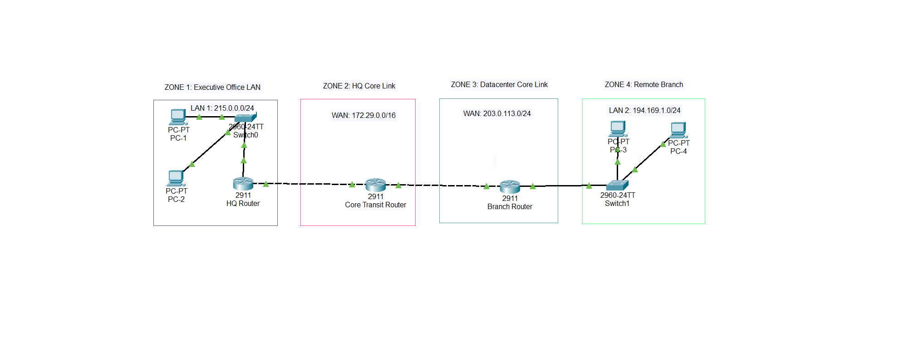

# Lab: IPv4 Addressing & Subnet Verification

## Objective
The purpose of this lab was to reinforce IPv4 addressing concepts by configuring router interfaces across four distinct networks and testing end-to-end connectivity. 

## Network Topology

## Technologies Demonstrated
* IPv4 Addressing & Subnet Masking
* Multi-Interface Router Configuration
* ICMP Connectivity Testing (Ping)

## The Experiment & Troubleshooting Analysis
The lab intentionally tests communication between Network 1 and Network 4. 

### Expected Result vs. Actual Result
* **Action:** Attempted to ping the PC-3 in Network 4 (ZONE 4) from PC-1 in Network 1 (ZONE 1).
* **Result:** The ping failed.    
**Error Encountered:** `Request timed out`.

### Root Cause Analysis
The ping failed due to a fundamental routing limitation:
1. **Directly Connected Networks:** The router successfully forwards traffic between networks that are directly connected to its physical interfaces.
2. **The Network 4 Issue:** Because Network 4 lacks a functional routing path, an end-to-end gateway, or static/dynamic routing protocols configured to bridge the gap between the isolated segments, the packets cannot map a return route hence are dropped by the HQ-Router.
3. **Subnet Validation:** The router interfaces correctly rejected overlapping subnets, proving the subnets were calculated accurately, but layout limitations prevented cross-network ICMP replies.

 ## Future Roadmap: Advanced Routing Implementations
This lab currently serves as a baseline verification for basic IPv4 subnet layouts and connected network behaviors. Once the corresponding theoretical modules are completed, this repository will be expanded to include:

### Phase 2: Static Routing Implementation
*   **Objective:** Resolve the current `Request timed out` error between Network 1 and Network 4.
*   **Tasks:** Configure manual static routes (`ip route`) on all participating routing interfaces to establish deterministic, end-to-end paths.
*   **Success Metric:** Achieve a 100% success rate on cross-network pings without dynamic overhead.

### Phase 3: Dynamic Routing via OSPF (Open Shortest Path First)
*   **Objective:** Transition the infrastructure from static paths to a scalable, dynamic routing architecture.
*   **Tasks:** 
    *   Enable the OSPF routing process (`router ospf <process-id>`).
    *   Define network statements and assign interface areas (Area 0).
    *   Verify neighbor adjacencies (`show ip ospf neighbor`) and routing tables (`show ip route ospf`).
*   **Success Metric:** Observe dynamic convergence and automatic rerouting if an active link fails.

## How to Run This Lab
1. Download `ipv4_subnets_lab.pkt`.
2. Open the file in Cisco Packet Tracer.
3. Open the Desktop terminal on PC-1 and run `ping [IP_of_PC_in_Net_4]` to reproduce the error.

